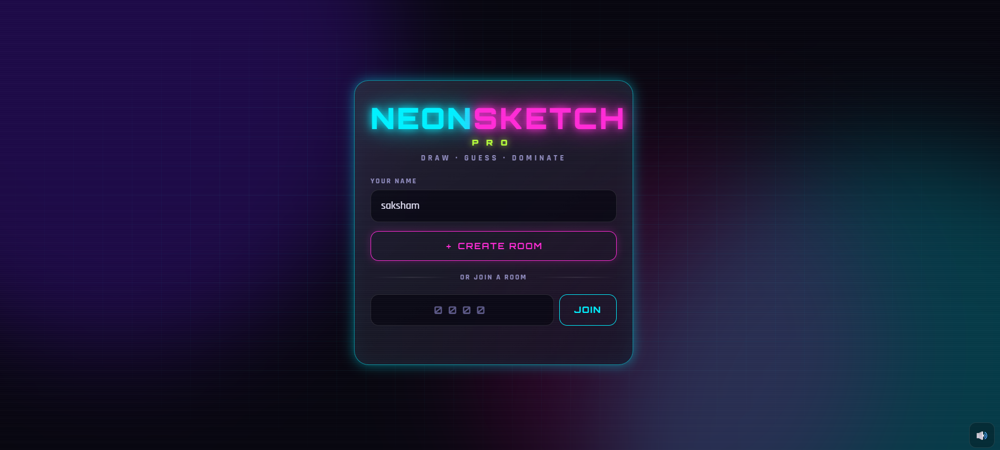
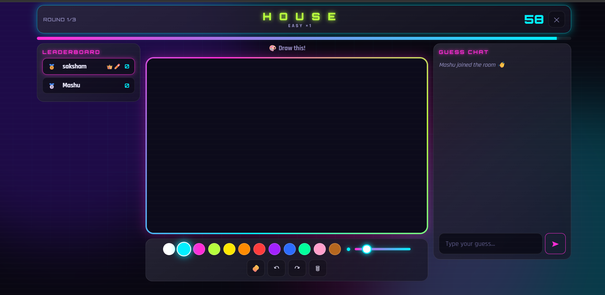
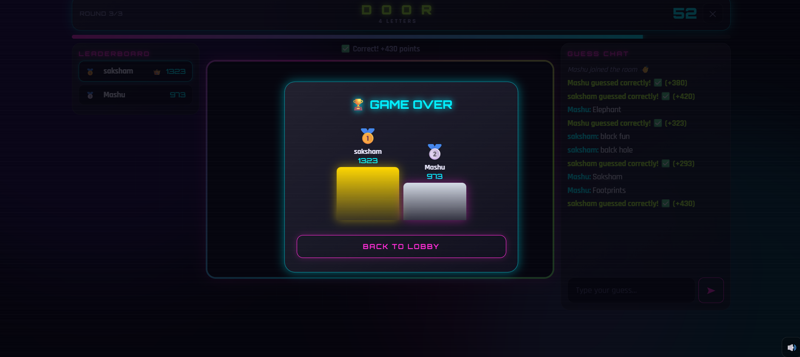
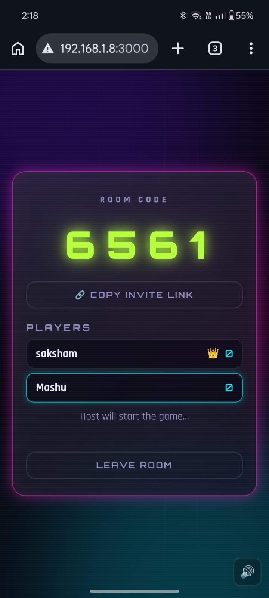

<div align="center">

# 🎨 NEON SKETCH PRO

### Real-time Multiplayer Draw & Guess Game

**Draw · Guess · Dominate — No signups. Just room codes.**

[](https://nodejs.org)
[](https://socket.io)
[](https://expressjs.com)
[](https://developer.mozilla.org/en-US/docs/Web/JavaScript)
[](LICENSE)

### 🌐 [**▶ PLAY LIVE DEMO**](https://your-live-url-here.onrender.com)

</div>

---

## 📖 Overview

**NEON SKETCH PRO** is a full-stack, real-time multiplayer drawing and guessing game built with a **cyberpunk-inspired interface**. One player draws a word on a shared canvas while other players race to guess it in the chat. The fastest correct guess earns the most points.

The project demonstrates **real-time bidirectional communication** with Socket.io, **HTML5 Canvas rendering** with Bezier smoothing, and **modular, production-grade architecture**.

---

## ✨ Key Features

| Feature | Description |
|---|---|
| 🎯 **Zero-friction onboarding** | No signup, no downloads — just enter a name and a 4-digit room code |
| ⚡ **Real-time sync** | Drawings, chat, scores, and timers update instantly across all devices |
| 🎨 **Adaptive difficulty** | Easy (×1) · Medium (×1.25) · Hard (×1.5) word choices with score multipliers |
| 🔥 **Smart hint system** | Letters reveal gradually as the timer drops; near-miss detection alerts close guesses |
| 🛡️ **Anti-cheat logic** | Drawer cannot reveal the answer (even `a-p-p-l-e` is blocked); guessed players get a private chat channel |
| 📱 **Fully responsive** | Play on phone, tablet, or desktop — touch, mouse, and pen supported |
| 🔄 **Resilient sessions** | 30-second reconnect grace period; survives phone locks and network drops |
| 🎵 **Audio & visual polish** | Synthesized sound effects (Web Audio API), confetti, glassmorphism UI |
| 🏆 **Rich scoring** | Speed bonus, first-guess bonus, streak bonus, difficulty multiplier, drawer reward |
| ⏱️ **Configurable rounds** | Host can choose 1–10 rounds and 30–180 seconds per turn |

---

## 📸 Screenshots

<div align="center">

### 🏠 Home — Create or Join a Room


### 🎮 Gameplay — Drawing & Guessing in Real Time


### 🏆 Winner Podium — Final Scores


### 📱 Mobile Experience


</div>

> **Note:** Add your own screenshots to a `screenshots/` folder in the root directory for these images to display.

---

## 🎮 How to Play

### 1. Create or Join a Room
Enter your display name and either **create a new room** (you'll get a 4-digit code) or **join an existing room** using a code shared by a friend.

### 2. Start the Game
The host configures the number of rounds and draw time, then clicks **Start Game**.

### 3. Take Turns Drawing
Each round, one player becomes the **drawer**. They receive three word choices (Easy / Medium / Hard) and pick one. Then they draw it on the shared canvas within the time limit.

### 4. Guess in Chat
All other players type guesses into the chat. The first correct guess earns the highest points. Near-misses receive a private "🔥 Very close!" hint.

### 5. Win the Game
After all rounds, the player with the highest cumulative score wins. A podium displays the top three players.

---

## 🧮 Scoring System

| Bonus Type | Points |
|---|---|
| **Base correct guess** | 100 |
| **Speed bonus** (faster = higher) | up to +300 |
| **First-guess bonus** (round's first correct) | +50 |
| **Streak bonus** (consecutive correct guesses) | +10 per streak (max +50) |
| **Difficulty multiplier** | Easy ×1 · Medium ×1.25 · Hard ×1.5 |
| **Drawer reward** (per correct guess) | +40 |

---

## 🛠️ Tech Stack

| Layer | Technology | Purpose |
|---|---|---|
| **Frontend** | HTML5, CSS3, Vanilla JavaScript (ES Modules) | UI, canvas, animations |
| **Backend** | Node.js 18+, Express.js 4.19 | HTTP server, static file serving |
| **Real-time** | Socket.io 4.7 (WebSockets) | Live drawing, chat, state synchronization |
| **Rendering** | HTML5 Canvas API | Smooth Bezier-curve drawing |
| **Audio** | Web Audio API | Synthesized sound effects (no audio files) |
| **Fonts** | Google Fonts — Orbitron, Rajdhani | Neon typography |
| **Storage** | sessionStorage + localStorage | Session persistence, name memory |
| **Security** | CSP headers, rate limiting, input sanitization | Production-grade protection |

---

## 🚀 Run Locally

### Prerequisites
- **Node.js 18+** → [Download](https://nodejs.org)
- **Git** → [Download](https://git-scm.com)

### Setup

```bash
# 1. Clone the repository
git clone https://github.com/sakshamkapil1244/neon-sketch-pro.git
cd neon-sketch-pro

# 2. Install dependencies
npm install

# 3. Start the server
npm start
